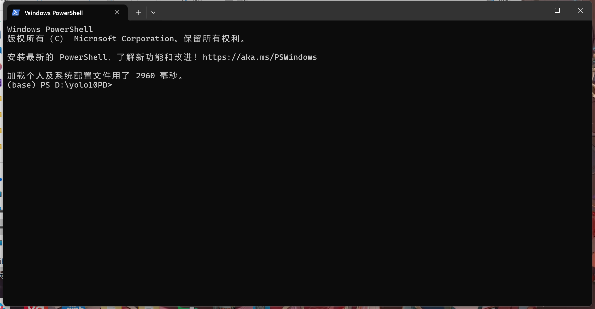

# YOLOv10-Pedestrian-Detection


# 复杂光照和遮挡条件下 YOLOv10 的行人实时检测算法研究
论文已投递，这是论文的代码，作为一名初学者，本说明文档旨在让更多的新手，也能随着文档一步步操作，直至快速完成所有项目与论文复现。

## Step1：准备阶段
- 硬件：如果想要简单验证效果，哪怕是CPU也可以；如果你希望训练自己的YOLO目标检测模型，应用在“电子游戏的游戏自动锁定敌方”，亦或者“电子游戏的每日任务自动刷副本”，那么我建议你使用带有N显卡的GPU，亦或者使用云GPU进行部署。
- 软件：本地部署YOLOv10前，你需要先安装好Python（版本大于等于3.10）和Git，这两个是必备的，如果你有基础，可以考虑使用Anaconda或者Miniconda，甚至Docker等。

## Step2：部署阶段（Windows）
### Step2.1：打开Powershell或cmd
- 首先，你可以在D盘新建一个文件夹（**新手请确保你的环境变量能让Python读取与运行D盘的文件**），然后将这个文件夹命名为yolo10PD（这一步的名字可以自行发挥）。
  
- 然后，如果你是Win11的系统，可以通过在进入该文件夹后，右键文件夹中空白的地方，然后启动PowerShell。
  
  并且，Powershell看起来是这样：
  
- 当然，如果你是Win11及以下的系统，也可以选择进入该文件夹后，点击上方显示路径的框格，然后输入cmd，打开命令行。Powershell与cmd的命令略有不同，如果你遇到了一些报错，询问AI是一个很好的选择。
  
  并且，cmd看起来是这样：
  
  
### Step2.2：创建并激活虚拟环境
- 在这里，你只要逐行复制粘贴代码到终端里运行，然后出现类似如图所示的变化，意味着你的操作成功了
- 对于Windows系统，当你使用Powershell时，请先粘贴第一段代码
  ```
    python -m venv yolovenv
  ```
  然后，激活它，输入以下代码
  ```
    yolovenv/Scripts/activate
  ```
  你将在Powershell中看到如图所示的绿色虚拟环境被高亮显示，意味着操作成功。
